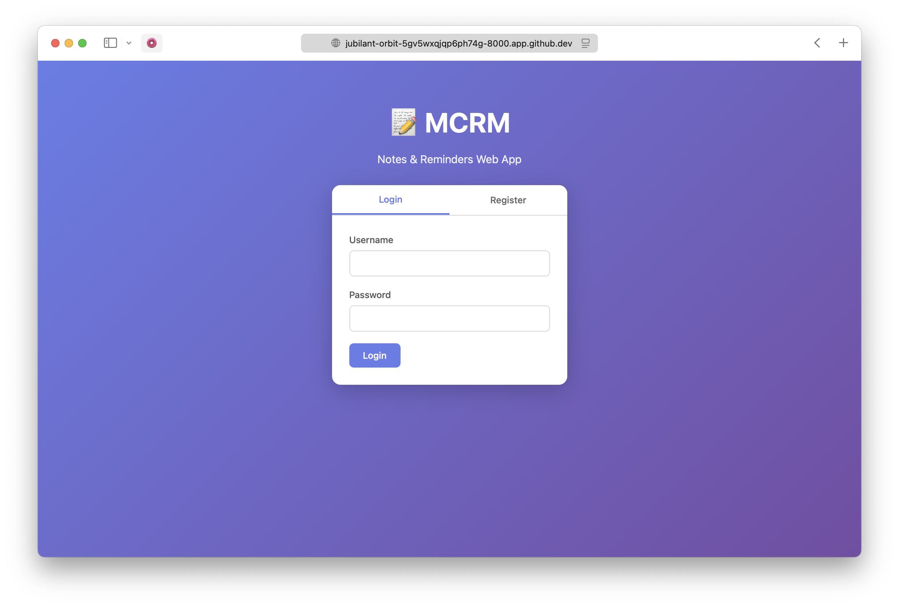
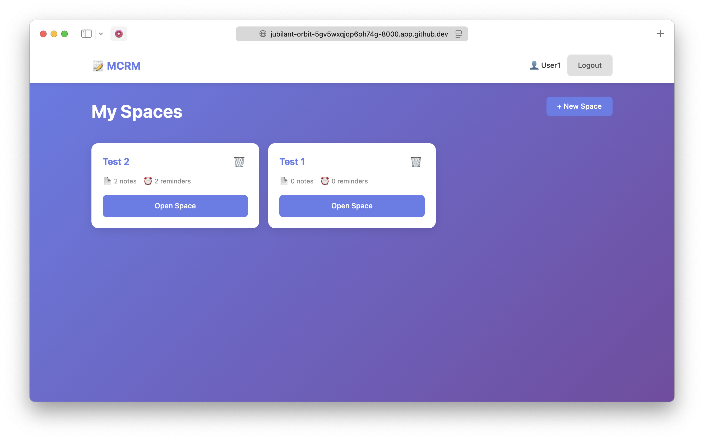
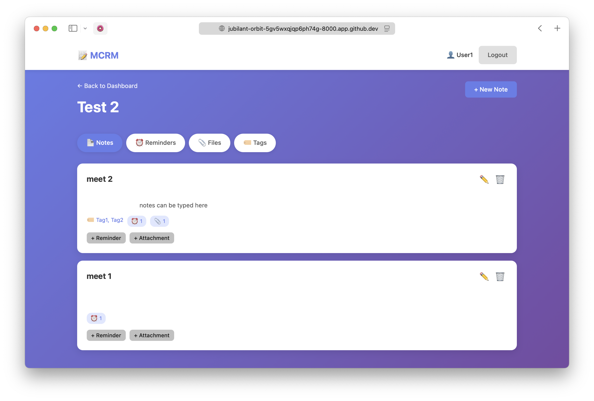
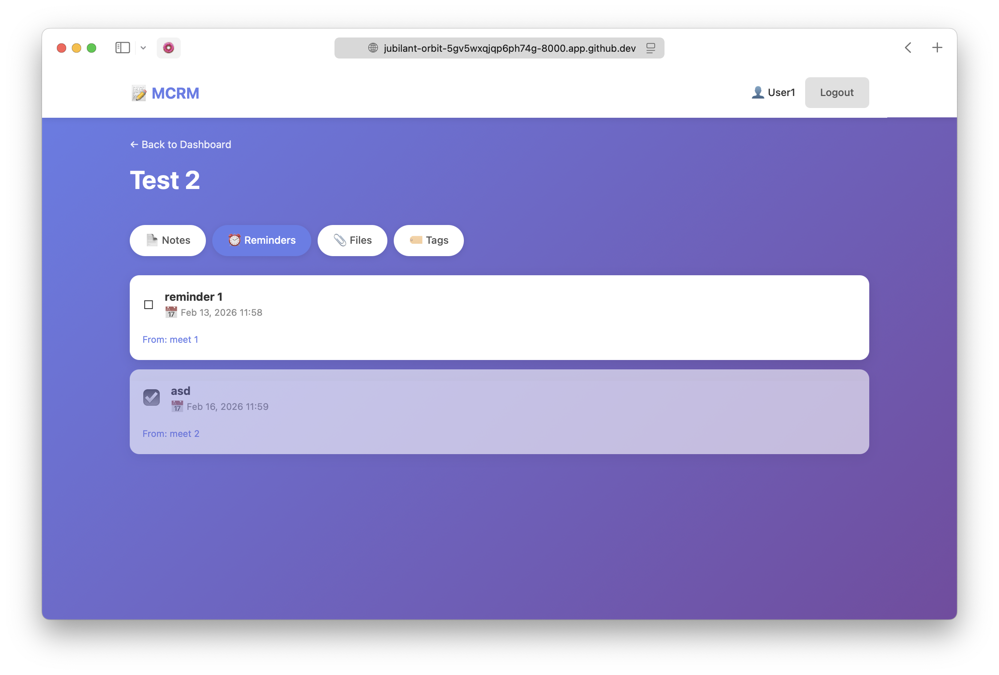
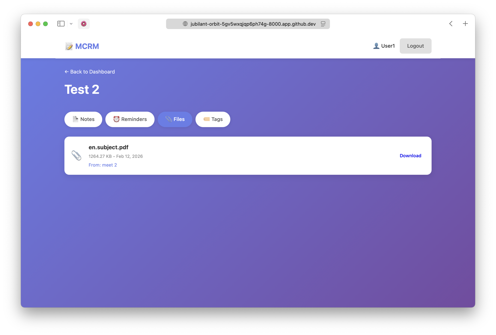
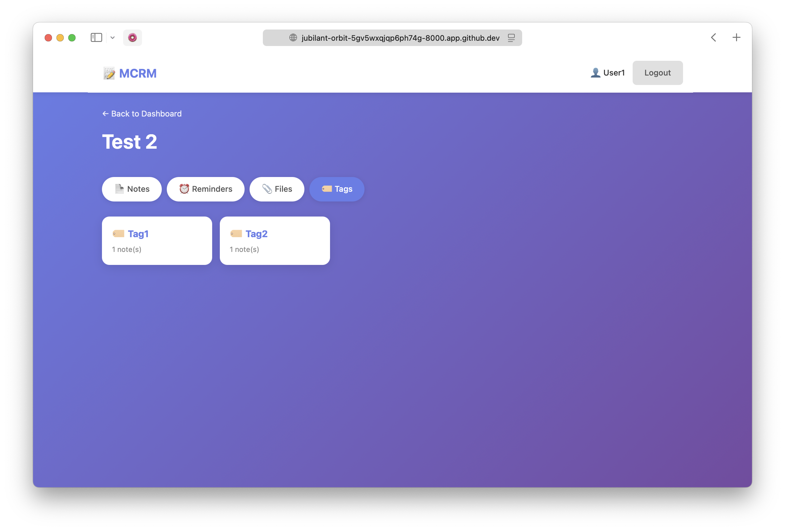

# MCRM - Notes & Reminders App

A PHP-based notes and reminders application that allows users to organize their notes into spaces and attach reminders and files.

## Features

- **User Authentication**: Secure login and registration system
- **Spaces**: Create separate spaces for different projects or categories
- **Notes**: Create and edit notes with simple text formatting
- **Reminders**: Add reminders to notes with due dates and completion tracking
- **File Attachments**: Upload and attach files to notes
- **Organized Views**: View all notes, reminders, and files within a space with tags showing their source

## Installation

1. **Prerequisites**:
   - PHP 7.0 or higher (PDO SQLite enabled by default)
   - Web server (Apache/Nginx)

2. **Clone or Download**:
   ```bash
   git clone https://github.com/Sapvit/mcrm.git
   cd mcrm
   ```

3. **Set Up File Permissions**:
   ```bash
   chmod 777 uploads/
   ```

4. **Access the Application**:
   - Navigate to `http://localhost/mcrm/` in your browser
   - The SQLite database will be created automatically on first access
   - Register a new user account to get started

   **That's it!** No manual database setup required. 🎉

## Usage

1. **Login/Register**: Create an account or login with existing credentials
2. **Create Space**: From the dashboard, create a new space for a project
3. **Add Notes**: Within a space, create notes with text content
4. **Add Reminders**: Open a note and add reminders with optional due dates
5. **Upload Files**: Attach files to notes for reference
6. **View Everything**: Use the tabs in a space to see all notes, reminders, or files

## Database

- **Type**: SQLite 3
- **Location**: `/data/mcrm.sqlite` (created automatically)
- **Schema**: 5 tables (users, spaces, notes, reminders, files) with proper relationships

### Database Tables

- **users**: User accounts
- **spaces**: User workspaces/projects
- **notes**: Notes within spaces
- **reminders**: Reminders linked to notes
- **files**: File attachments for notes

## Security

- Passwords are hashed using PHP's `password_hash()`
- All database queries use prepared statements to prevent SQL injection
- File uploads are stored with unique names to prevent conflicts
- User authentication is required for all actions
- Foreign key constraints enforce data integrity

## Technologies Used

- PHP 7+ with PDO for database access
- SQLite 3 for lightweight data storage (no server required)
- Vanilla JavaScript for interactive features
- CSS3 for styling

## Project Structure

```
mcrm/
├── index.php                 # Login page
├── register.php              # Registration page
├── dashboard.php             # User dashboard with spaces
├── space.php                 # Space view with notes, reminders, files tabs
├── note.php                  # Note detail page
├── config.php               # Database configuration & auto-initialization
├── create_*.php             # Create handlers (space, note, reminder)
├── edit_*.php               # Edit handlers
├── delete_*.php             # Delete handlers
├── upload_file.php          # File upload handler
├── toggle_reminder.php      # AJAX reminder completion toggle
├── logout.php               # Logout handler
├── setup.php                # Manual database setup (optional)
├── assets/
│   ├── css/style.css        # Application styling
│   └── js/script.js         # Modal and interactive features
├── data/
│   └── mcrm.sqlite          # SQLite database (auto-created)
├── uploads/                 # File storage directory
└── documentation files

```

## File Upload Limits

- Maximum file size: 10MB
- Allowed file types: jpg, jpeg, png, gif, pdf, doc, docx, txt, zip, rar, xlsx, xls, ppt, pptx

## Documentation

- **INSTALL.md** - Installation and deployment guide
- **QUICKSTART.md** - Quick start guide for first-time users
- **TESTING.md** - Comprehensive testing procedures
- **STRUCTURE.md** - Application architecture and design
- **SUMMARY.md** - Project overview and implementation details

## Features Overview

### Spaces
- Create unlimited spaces to organize projects
- Each space is independent and contains its own notes
- View all notes, reminders, and files in a space

### Notes
- Simple text notes with titles and content
- Edit and delete anytime
- Support for line breaks and formatting
- Automatic timestamps for creation and updates

### Reminders
- Add to any note for task management
- Optional due dates and times
- Check off when complete (AJAX-powered, no page reload)
- View all space reminders in one place

### Files
- Attach multiple files to any note
- Download anytime
- See all space files aggregated with source notes
- Secure storage with unique filenames

## First Run

When you first access the application:
1. Go to `http://localhost/mcrm/`
2. Click "Register here"
3. Create your account
4. Start creating spaces and notes!

The database is created automatically - no setup.php needed!

## Troubleshooting

**Database Issues:**
- Ensure `/data` directory is writable by your web server
- Check that SQLite PHP extension is enabled: `php -m | grep sqlite`
- Database location: `/data/mcrm.sqlite`

**File Upload Issues:**
- Check uploads directory permissions: `chmod 777 uploads/`
- Verify PHP upload settings in `php.ini`
- Check available disk space

**Session Issues:**
- Ensure session directory is writable
- Check `session.save_path` in `php.ini`

## Production Deployment

For production use:
1. Store the database file outside the web root
2. Use environment variables for configuration
3. Enable HTTPS
4. Set proper file permissions (644 for files, 755 for directories)
5. Disable error display and enable logging
6. Regular backups of the database

See **INSTALL.md** for detailed production setup.

## Support

For questions or issues:
- Check **TESTING.md** for comprehensive testing guide
- Review **STRUCTURE.md** for application architecture
- Check PHP error logs
- Verify all requirements are met

## License

This application is provided as-is for educational and personal use.

## Screenshots

### Authentication


### Dashboard & Spaces


### Space with Notes


### Note Detail Page


### Reminders Management


### Files & Attachments


